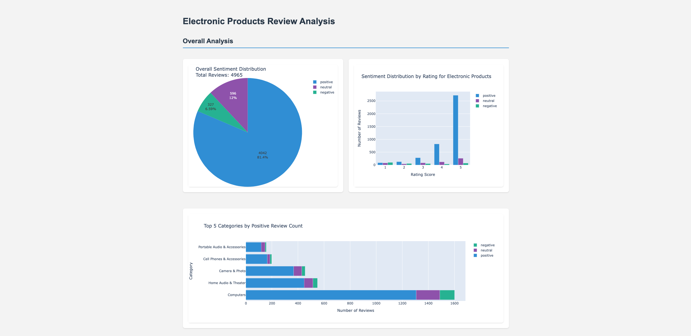

# Amazon Electronics Review Sentiment Analysis

A comprehensive sentiment analysis project analyzing Amazon Electronics product reviews using VADER sentiment analysis.

## Project Overview

This project conducts sentiment analysis on Amazon product reviews in the Electronics category. Using Natural Language Processing (NLP) techniques and the VADER sentiment analyzer, we analyze customer sentiment patterns and derive insights from user feedback.

### Key Features

- Sentiment analysis using VADER
- Interactive visualizations of sentiment trends
- Keyword analysis and feature extraction
- Product and brand-level sentiment insights
- Comprehensive data preprocessing pipeline

## Getting Started

### Prerequisites

- Python 3.8 or higher
- Conda (Anaconda/Miniconda)
- Git (for cloning the repository)

### Required Packages

```yaml
name: sentiment_analysis_env
dependencies:
  - python=3.9
  - pandas
  - numpy
  - matplotlib
  - seaborn
  - tqdm
  - wordcloud
  - flask
  - pip
  - pip:
      - vaderSentiment
      - notebook
      - plotly
      - nbformat
```

### Installation

1. Clone the repository:

```bash
git clone https://github.com/yourusername/Five-Star.git
cd Five-Star
```

2. Create the Conda environment:

```bash
conda env create -f environment.yml
```

3. Activate the environment:

```bash
conda activate sentiment_analysis_env
```

4. Start Jupyter Notebook:

```bash
jupyter notebook
```

5. Verify the installation:

```bash
python -c "import pandas, numpy, matplotlib, seaborn, tqdm, wordcloud, flask, vaderSentiment, notebook, plotly, nbformat; print('Setup successful!')"
```

## Project Structure

```
Five-Star/
├── data/                    # Data files and analysis results
├── docs/                    # Project documentation and rubrics
├── notebooks/              # Jupyter notebooks for analysis
├── src/                    # Python source code files
├── templates/              # HTML templates
├── .gitignore             # Git ignore file
├── environment.yml        # Conda environment configuration
├── Final_SA_Amazon_Presentation.pptx  # Final presentation
└── README.md              # Project documentation
```

## Data Sources

The project uses the Amazon Product Reviews dataset from 2014, available at:
https://jmcauley.ucsd.edu/data/amazon/index_2014.html

### Review Information

#### Core Review Data

| Column Name | Description                         |
| ----------- | ----------------------------------- |
| reviewer_id | Unique identifier for each reviewer |
| asin        | Amazon product identifier           |
| review_text | Full text of the review             |
| overall     | Star rating (1-5 scale)             |
| summary     | Short review title/summary          |

#### Review Metadata

| Column Name      | Description                          |
| ---------------- | ------------------------------------ |
| helpful          | List of [helpful_votes, total_votes] |
| helpful_ratio    | Ratio of helpful to total votes      |
| unix_review_time | Review timestamp (Unix format)       |
| review_time      | Review date (MM DD, YYYY)            |
| review_date      | Review date (YYYY-MM-DD)             |
| formatted_date   | Standardized date format             |

#### Text Analysis

| Column Name    | Description                                      |
| -------------- | ------------------------------------------------ |
| cleaned_text   | Preprocessed review text                         |
| processed_text | Tokenized/stemmed text                           |
| review_length  | Character count                                  |
| word_count     | Number of words                                  |
| sentiment      | Calculated sentiment (positive/neutral/negative) |

#### Product Information

| Column Name   | Description           |
| ------------- | --------------------- |
| category      | Raw product category  |
| main_category | Main product category |
| description   | Product description   |
| title         | Product name          |
| brand         | Manufacturer          |
| price         | Product price in USD  |

## Dashboard

To run the interactive visualization dashboard:

```bash
cd src
python 04_data_visualization_advanced_part4.py
```

This will start a local server and launch the interactive dashboard in your default web browser.

The dashboard provides:

- Real-time sentiment analysis visualization
- Interactive category filtering
- Brand comparison tools



## Analysis Features

- Sentiment classification using VADER
- Word frequency analysis
- Brand and product category sentiment trends
- Temporal sentiment analysis
- Review helpfulness correlation

## Usage

1. Start by exploring the Jupyter notebooks in the `notebooks/` directory
2. Load and preprocess data using provided scripts
3. Run sentiment analysis on desired product reviews
4. Generate visualizations and insights

## Maintenance

To update the environment with new dependencies:

```bash
conda env update -f environment.yml --prune
```

To deactivate the environment:

```bash
conda deactivate
```

## Results

Our analysis revealed several key insights:

- 80% of impactful words in reviews are negative
- Price is the most discussed feature (1,468 mentions)
- Quality and performance are significant factors in reviews
- Product returns and functionality issues strongly correlate with negative sentiment

## Team Members

- Yi Zu
- Nishtha Sawhney

## License

This project is part of the DS5110 course at Northeastern University.

## Additional Resources

- [VADER Sentiment Analysis Documentation](https://github.com/cjhutto/vaderSentiment)
- [Original Dataset Paper](https://cseweb.ucsd.edu/~jmcauley/pdfs/recsys13.pdf)
